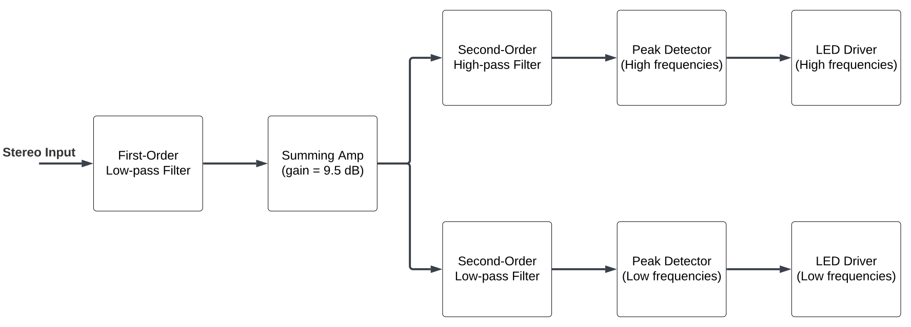

# Audio Processing Circuit
*This project was completed for ECE 2660 (Fundamentals of Electrical Engineering 2) at UVA*

### Project Goals

The goal of this project was to design an audio processing circuit that produces an LED light show synchronized to an analog audio input. The design was verified using numerical simulations and prototyping on a breadboard before being implemented on a custom PCB.

### Approach

In order to obtain the desired behavior, my group decided to divide the circuit into five stages:

<ol>
    <li>First-order low-pass filter (remove any DC offset)</li>
    <li>Summing Amplifier (to add left and right audio channels while amplifying input)</li>
    <li>Second-order filters (in parallel, separate audio into high frequency and low frequency content)</li>
    <li>Peak detector (used to control gate voltage on MOSFETs)</li>
    <li>LED Driver (MOSFETs to act as current sources for the LEDs)</li>
</ol>

The block diagram of the design is shown below.

    

### Outcomes

 <b> Design Outcomes </b>

<a href='https://drive.google.com/file/d/1BzGDr5KGOWbXzDZB6MnlPckeqaR7Nucz/view?usp=sharing' target="_blank">Click here</a> to see a video in which my team and I explain the design of the project in more detail, or see the embedded clip below for a brief demonstration of the final circuit.

<iframe src="https://drive.google.com/file/d/1aPWm53_OFiIYXDXPR1k10dUbPj_MUUKt/preview" width="100%" height="480" allow="autoplay"></iframe>

 <b> Skill-related Outcomes </b>

<ul>
    <li>Practiced delegating tasks on a larger-scale project and separating the role of designer and verifier</li>
    <li>Applied the Fourier transform to a practical problem when determining cutoff frequencies</li>
    <li>Identified, isolated, and fixed bugs on a custom PCB</li>
</ul>

### Report

For more details about the project, check out the report embedded below.

<object data="../../assets/DesmanECE2660Report.pdf" style="width:100%;height:100%;" type='application/pdf'></object>

